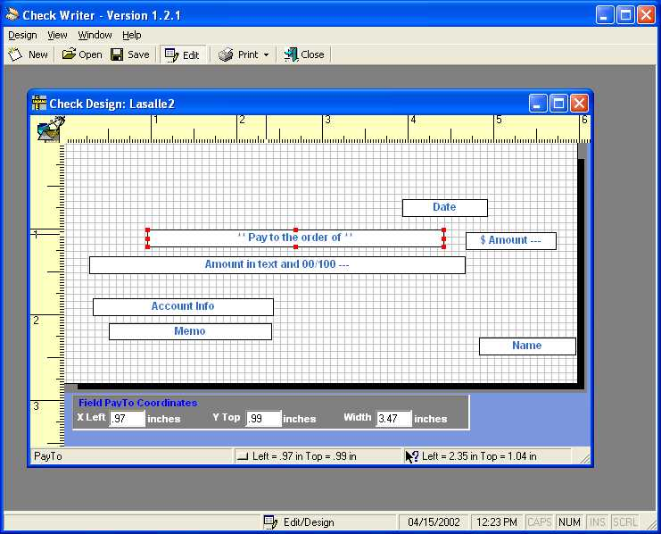



## Check Writer

### Description

This complete program prints check data onto checks using a holder to hold the check on a piece of paper and then feed through a printer.

Since each check is slightly different there is a designer that will allow you to move the fields around using point and click (drag and drop) or key in the position (in inches) of a preset fields.

Finally, a data entry screen to type your check data with Autocomplete function and print it.

Other items of interest: wizards, option screen to set default check design and printer and a simple help file.

The code in this project will show how to use the Printer Object to print lines and text in specific positions. Using some routines to select a control, move it on the form, and much more).

----

Credits:

* AutoComplete is from PSC (sorry, don't know who the author is).

* The moving of controls is from a sample on vbsquare.com (however, I made it into a class).

Some of the coding might not be "Best Practice" b/c it was a learn as I go project.

* Ruler code is from www.freevbcode.com
 
### More Info
 

             |
---                |---
**Submitted On**   |2002-04-15 12:06:20
**By**             |[PeteS](https://github.com/Planet-Source-Code/PSCIndex/blob/master/ByAuthor/petes.md)
**Level**          |Intermediate
**User Rating**    |5.0 (104 globes from 21 users)
**Compatibility**  |VB 5\.0, VB 6\.0
**Category**       |[Complete Applications](https://github.com/Planet-Source-Code/PSCIndex/blob/master/ByCategory/complete-applications__1-27.md)
**World**          |[Visual Basic](https://github.com/Planet-Source-Code/PSCIndex/blob/master/ByWorld/visual-basic.md)
**Archive File**   |[Check\_Writ729354172002\.zip](https://github.com/Planet-Source-Code/petes-check-writer__1-33884/archive/master.zip)

